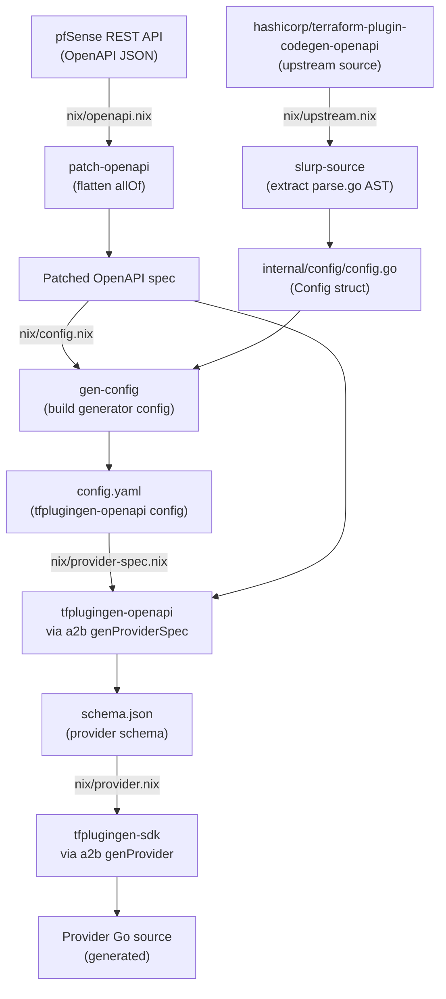

# terraform-provider-pfsense

[](https://github.com/UnstoppableMango/terraform-provider-pfsense/actions/workflows/ci.yml)
[](https://pkg.go.dev/github.com/unstoppablemango/terraform-provider-pfsense)
[](go.mod)
[](LICENSE)
[](flake.nix)
[](https://github.com/UnstoppableMango/terraform-provider-pfsense/commits/main)

A [Terraform](https://www.terraform.io/) provider for [pfSense](https://www.pfsense.org/), generated entirely from the [pfSense REST API](https://github.com/pfrest/pfSense-pkg-RESTAPI) OpenAPI specification via a [Nix](https://nixos.org/)-driven pipeline.
No provider code is written by hand.

> **Note:** This project is in progress.
> The pipeline currently produces generated provider Go source code.
> Compilation into a final provider binary is not yet complete.

## How it works

The provider is produced by a multi-stage code generation pipeline that transforms the upstream pfSense OpenAPI spec into provider Go source code.



### Pipeline stages

| Nix derivation | Tool | Input | Output |
|---|---|---|---|
| `nix/tools.nix` | Go compiler | `cmd/` Go source | CLI tools binary |
| `nix/upstream.nix` | `slurp-source` | [`hashicorp/terraform-plugin-codegen-openapi`](https://github.com/hashicorp/terraform-plugin-codegen-openapi) | `internal/config/config.go` |
| `nix/openapi.nix` | `patch-openapi` | pfSense REST API [OpenAPI release](https://github.com/pfrest/pfSense-pkg-RESTAPI/releases) | Patched `openapi.json` |
| `nix/config.nix` | `gen-config` | Patched OpenAPI spec | `config.yaml` |
| `nix/provider-spec.nix` | [`tfplugingen-openapi`](https://github.com/hashicorp/terraform-plugin-codegen-openapi) via [`a2b`](https://github.com/UnstoppableMango/a2b) | Config + OpenAPI spec | `schema.json` |
| `nix/provider.nix` | [`tfplugingen-sdk`](https://github.com/hashicorp/terraform-plugin-codegen-sdk) via [`a2b`](https://github.com/UnstoppableMango/a2b) | `schema.json` | Generated provider Go source |

## Requirements

- [Nix](https://nixos.org/) with flakes enabled
- [direnv](https://direnv.net/) (optional, for automatic dev shell activation)

## Usage

```bash
# Build the default output (generated provider Go source)
nix build

# Build individual pipeline stages
nix build .#tools       # CLI tools binary
nix build .#openapi     # patched pfSense OpenAPI spec
nix build .#config      # generated tfplugingen-openapi config YAML
nix build .#spec        # generated provider schema JSON
nix build .#provider    # generated provider Go source (same as default)
```

## Development

```bash
# Enter dev shell (or use direnv)
nix develop

# Run tests
go test ./...

# Lint / format
nix flake check

# Update Go dependencies
go mod tidy
gomod2nix generate --outdir ./nix

# Update Nix flake inputs
make update
```

### Adding a resource

Edit `pkg/config.go` -> `ConfigFor()` to add an entry to the `Resources` map with the appropriate OpenAPI path and method for each CRUD operation.
The downstream Nix pipeline picks up the change on the next `nix build`.

## Key dependencies

- [pb33f/libopenapi](https://github.com/pb33f/libopenapi) - OpenAPI v3 parsing and bundling
- [hashicorp/terraform-plugin-codegen-openapi](https://github.com/hashicorp/terraform-plugin-codegen-openapi) - generates provider schema from OpenAPI spec
- [hashicorp/terraform-plugin-codegen-sdk](https://github.com/hashicorp/terraform-plugin-codegen-sdk) - generates provider Go code from schema
- [UnstoppableMango/a2b](https://github.com/UnstoppableMango/a2b) - Nix functions wrapping the HashiCorp codegen toolchain
- [nix-community/gomod2nix](https://github.com/nix-community/gomod2nix) - reproducible Go builds in Nix
- [pfrest/pfSense-pkg-RESTAPI](https://github.com/pfrest/pfSense-pkg-RESTAPI) - upstream pfSense REST API and OpenAPI spec

## License

[MIT](LICENSE)
